<h1>Shaders</h1>

<h2>1. Origem e Exemplos:</h2>
 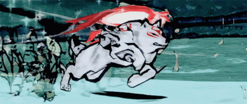
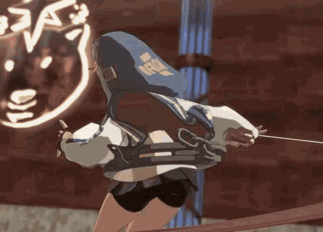

 
 
SSS 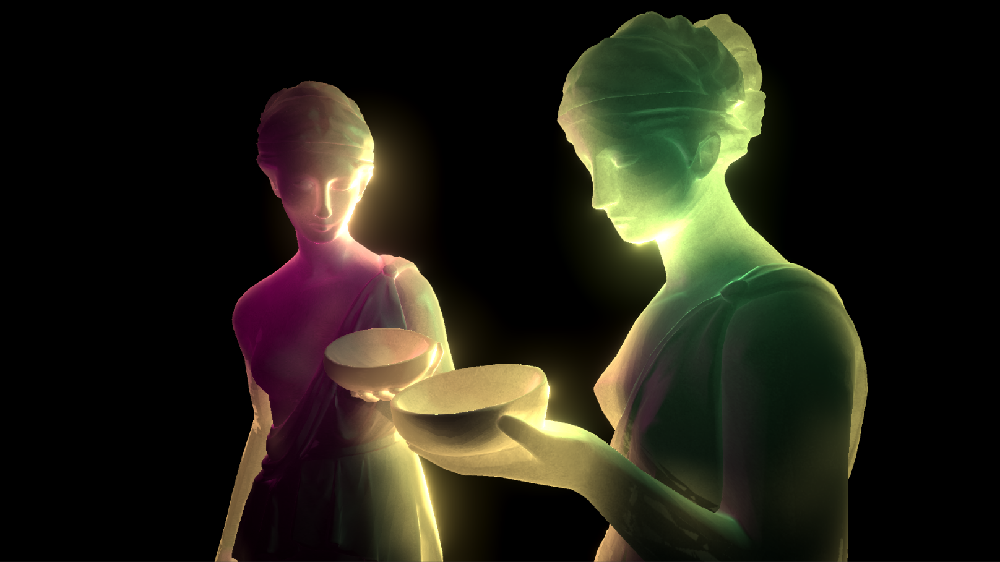 
RayTracing 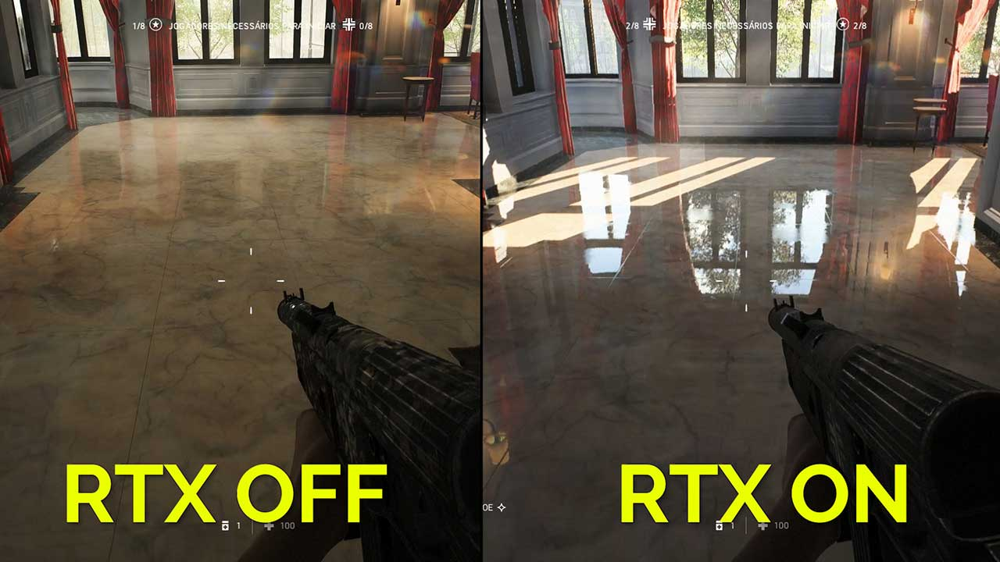 
Raymarching  
Tessellation 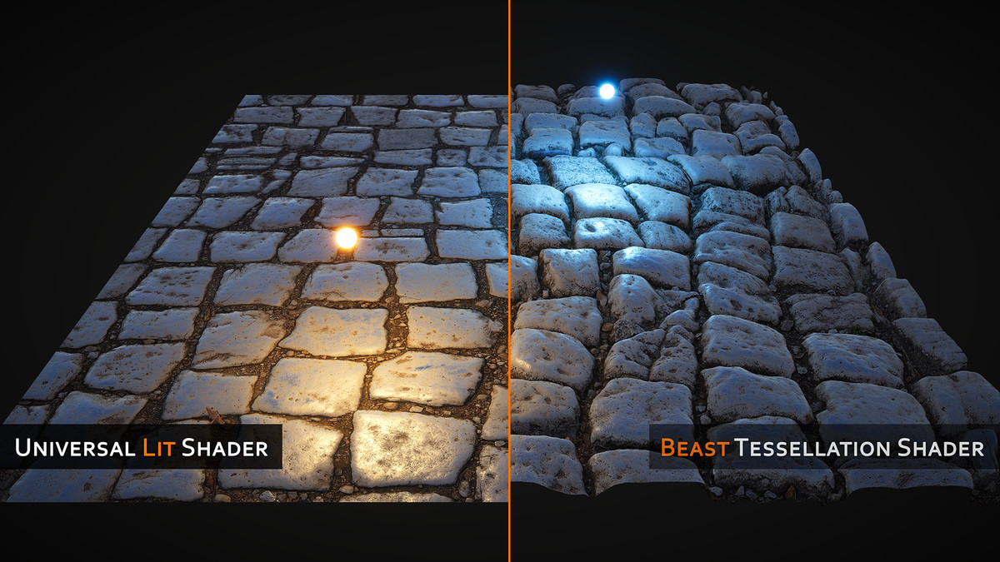 
 
2D 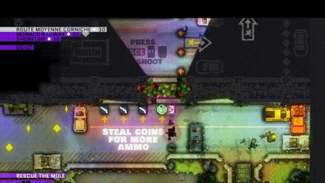 

<h2>2. Tipos</h2>

- Vertex & Fragment e Surfaces 
  - Um simples shader com textura sem calculo de iluminação 
    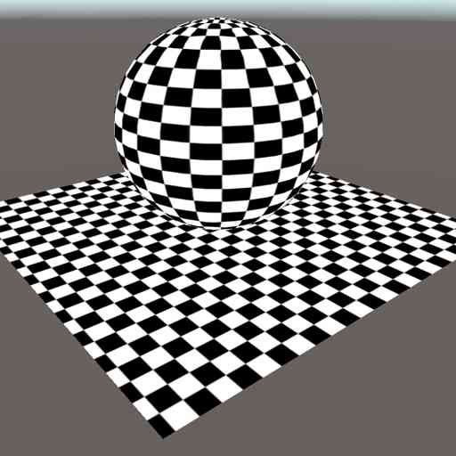
  - Varios tipos de informações 
    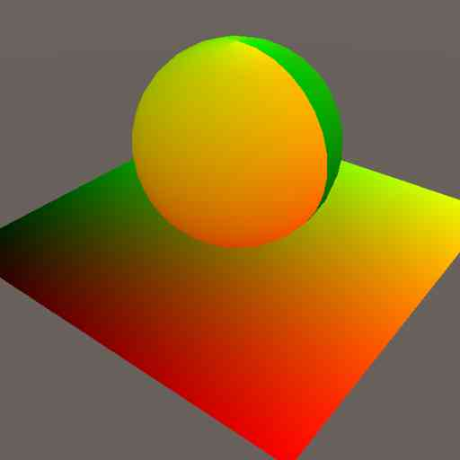
    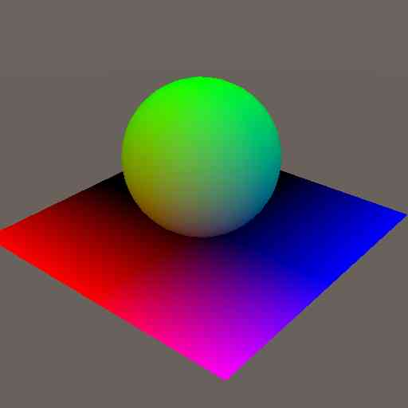
    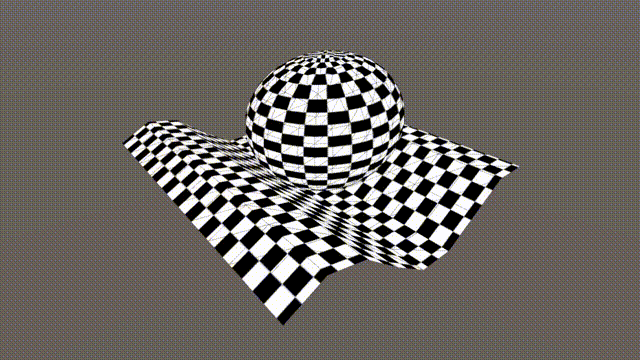
  - até os resultados mais comuns 
    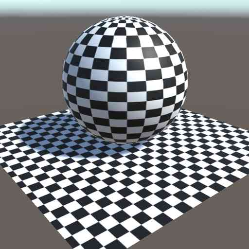
- Geometry  
    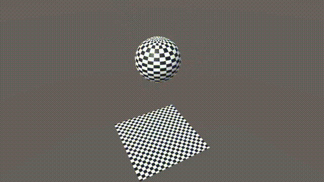
  - Introduzido na DX10 ele itera não só sobre os vértices da malha como nos triangles e edges dando muito mais possibilidades.
  - Um detalhamento mais low level
    - "https://takinginitiative.wordpress.com/2011/01/12/directx10-tutorial-9-the-geometry-shader/"
- Pixel
  - Usado em postprocessing sua funcionalidade é similar ao frag

<h2>3. Debugar e Planejar</h2>

- Matematica
  - Um dos elementos mais usados durante o desenvolvimento de shaders são cálculos matemáticos, muitos deles já vem prontos em alguma biblioteca ou são fáceis de reescrever no shader, porém, muitas vezes são necessário o conhecimento mais aprofundado de certos conceitos matemáticos
  - Matrizes, tudo em 3D usa matriz para se deslocar no espaço, é importante entender os conceitos básicos.
  - Funções e Gráficos, como shaders são basicamentes um monte de multiplicações que no final se tornam cor, saber interpretar um gráfico e entender como gerar uma forma a partir de uma função é vital.
  - Trigonometria e geometria analitica, games usa vetor para todo lado, mas diferente de quando se está desenvolvendo uma funcionalidade em um aplicativo, não podemos visualizar ou fazer um print nessa hora ter a base de trigonometria e geometria analitica pode ajudar muito.
  - Para mais informações: https://thebookofshaders.com/